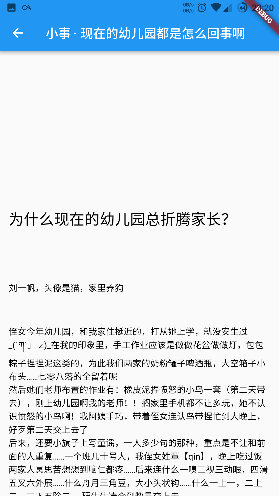

### flutterAndroidClient
仿 知乎日报 的 flutter 的 例子.只兼容了 Android . 未考虑 iOS, 实现了日报 的列表页 和 详情页.

    
    

### 运行
安装 官方文档 配置 flutter;
使用 master分支安装, flutter 版本 为 0.58

flutter run 

### 结构
列表页 与 详情 也 都位于 `/zhihu/MainPage.dart`

目前 详情页. flutter 官方不 支持 webView, 所以加载的 html 有些标签无法显示;

列表页 上滑加载 未实现完整逻辑 ,暂时 只是与 下拉刷新相同 逻辑;暂时搁置

重构 将 MainPage 分为 列表页,详情页 和 ApiUtil; 暂时搁置.
 
